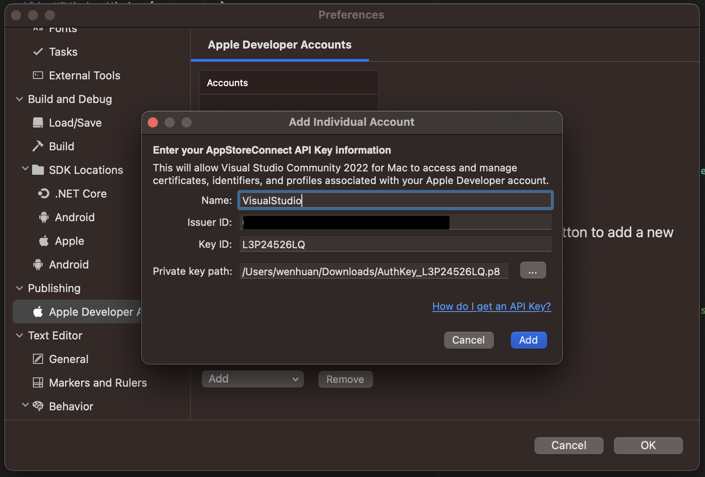

# A Guide to Publish iOS App from Visual Studio for Mac

This is a guide to configurate App Connect Account and Visual Studio for Mac to publish iOS App to the Store. Due to the nature of the process what you need may be different on each machine and the relatively maturity between Visual Studio and App Connect API at the time.

To continue with this guide, you are supposed to have a Xamarin project already. You can also create an empty 1-page project from Visual Studio project templates.

## Setup App Connect API Key

You need to do this so that Visual Studio can work with Apple App Connect.

1. Go to [https://appstoreconnect.apple.com]().
2. Go to `Users and Access` -> `Keys`.
3. (Optional) Request access if needed.
    
4. Click `Generate API Key` and give it a name and `Admin` access.
    
5. Download the generated key. It is a `*.p8` file. Note down other info on the webpage, as they are needed in the next step.
    
6. Import the downloaded key in Visual Studio for Mac.
    
    

## Create distribution certificates

This may be optional. You can do this now, or come back and do this later if Visual Studio failed to do it automatically.

1. Create an Apple Distrubution certificate, either in Xcode or Visual Studio.
    
    
2. Repeat above but this time create an Apple Development certificate instead.
    

## Install Apple Certificates

This is optional. You can do this later when encoutered error regarding `untrusted key/cert`. But increasing you would get those errors even when working with Xcode directly. So it is good idea to do this once on each development machine you would use.

1. Go to [https://www.apple.com/certificateauthority/]().
2. Download all `Root Certificates` and `Intermediate Certificates`.
3. Install all downloaded certificated by double clicking them. When asked where to install select `System` key chain.

## Configurate Visual Studio Project

1. Select the `Info.plist` file.
2. Near top right of the Visual Studio window, select `Application` from the drop down list.
3. Select `Automatic Provisioning` then select your team. You will see a spinning progress and if API key is set up correctly you will see it succeeds.
4. Note the `Bundle Identifer` field, this is where you can change your bundle ID, once published, you cannot change it any more.
5. Go to [https://developer.apple.com/account/resources/identifiers/list]() and create an ID with the same ID string in step 4. This is optionally, Visual Studio is supposed to create one automatically same as Xcode, but somehow it may not work.
6. Go to [https://appstoreconnect.apple.com/apps]() and created an App with the ID created in step 5.

## Distribute App

1. In Visual Studo, `Build -> Archive for Publishing`. Make sure to select a connected real iPhone or Generic Device first.
    
2. Select App Store
    
3. Select Upload
    
4. Select Provisioning Profile, if you didn't see a provisioning profile below, follow the next step to create one.
    
5. If somehow with App Connect API Key and Auto Provisioning set up in the previous steps, you do not see a provisioning profile for the project created automatically, create one manually.
    a. Go to [https://developer.apple.com/account/resources/profiles/list]().
    b. Generate a new provisioning profile.
        
    c. Select a distribution certificate. This is usually the one you created above in this guide, if you have chosen to do so.
        
    d. Download the generated provisioning profile and double click to install.
        
    e. You should see the newly installed provisoning profile.
        
    f. Now Info.plist would change to Manual Provisioning. It is OK.
    g. Retru step 4.
6. Use an App specific password to start to upload. Follow the guide in the link to create one if needed. `Save this App specific password` as Visual Studio would ask you every time, unlike some other password for similar purpose is set and forget.
    
7. Now you are good to upload. Either it succeeds or you see some validation error like below, which also means App uploaded to but denied by Apple server.
    
